# Project-1 - Crypto and Stable Coin Analysis 

## Members: Evan S, William W, Avi P

# Presentation - https://bit.ly/nwbootcamp-p1

## Technologies used:
* ### Rapid API - Api Dojo - https://rapidapi.com/apidojo/api/investing-cryptocurrency-markets/

* ### Alpaca API - https://alpaca.markets/

* ### Anaconda -
    * Navigate to the Anaconda website in order to download the appropriate installer.
    * https://www.anaconda.com/products/distribution#windows 

* ### Anaconda - conda environments 
            <!-- (After installing Anaconda we need to enable the terminal commands) -->

            conda init bash

            <!-- (Close your terminal and open a new one) -->

            conda update conda
            conda update anaconda

            <!-- (Now we need to create a suitable environment to run our jupyter lab and
             install libraries necessary for pyviz) -->

            conda activate base
            conda create -n pyvizenv python=3.7 anaconda -y

            conda activate pyvizenv

            conda install -c conda-forge python-dotenv -y
            conda install -c anaconda nb_conda -y
            conda install -c conda-forge nodejs=12 -y
            conda install -c pyviz holoviz -y
            conda install -c plotly plotly -y
            conda install -c conda-forge jupyterlab=2.2 -y
            conda install -c anaconda numpy==1.19 -y
            conda install -c conda-forge matplotlib==3.0.3 -y

            jupyter labextension install @jupyter-widgets/jupyterlab-manager --no-build
            jupyter labextension install jupyterlab-plotly --no-build
            jupyter labextension install plotlywidget --no-build
            jupyter labextension install @pyviz/jupyterlab_pyviz --no-build
            jupyter lab build

            pip install alpaca-trade-api

            <!-- (Remember to also setup a dot env file containing api keys)  -->

* ###  Pyfolio library - can be quick installed using:
            pip install pyfolio
        

## Overall Aim
Our project will mainly focus on the analysis of crypto currencies and stable coins. We will be using plots generated from our analysis to make comparisons between the data we have collected in order to make informed decisions if either the crypto currencies are good forms of investment and if the stable coins are able to maintain a constant value as to be beneficial as a vehicle for 1 to 1 transfer of currency. We will be looking at the following cryptos and stable coins:

* Bitcoin 
* Ethereum
* Luna
* Binance - BUSD stable coin
* Tether - USDT stable coin
* Dai - DAI stable coin 
* Coin (Circle) - USDC stable coin 

Due to the differing types of financial instruments we are running analysis on each group will only be compared within itself as there would be no benefit from running analysis crossed between both types. 

## General Process

* ## Data collection and cleaning 
The data will be collected using API Dojo from Rapid API website. The link is provided in the the technology used section. After connection has been established we set up GET Requests to retreive the data. Pass the data into a json format for easier parsing and dataframe setup. Using Pandas we are able to parse the data to find the important financial information for the different instruments. Unfortunately the API will only provide 1 years worth of current data. In order to over come this problem we chose to call the data 3 times in with different params in order to get 3 years worth of data. After putting each years data into a dataframe we will concat the dataframes to form one main dataframe so that all data is equal in length and analysis will be easier. Having combined the data we need to clean it. We dropped 'perc_chg' and 'color' columns. We drop any duplicates in the 'date' column before setting the date as the index. Some columns like 'volume' must have the ',' and letter values like - 'K' , 'M', 'B' replaced or evaluated. The last part of the cleaning process will be changing the datatypes for the dataframe. 

* ## Crypto Analysis and Plots
    * Price Comparisons - Comparing the price points on a daily basis over a 2 year timeframe.  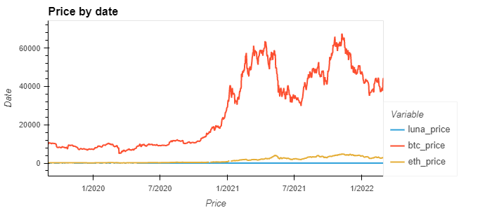

    * Aggregate Returns - On a weekly basis, the function will calculate the percentage change of the original. Fairly cut and dry that week over week the best investment option would be bitcoin. 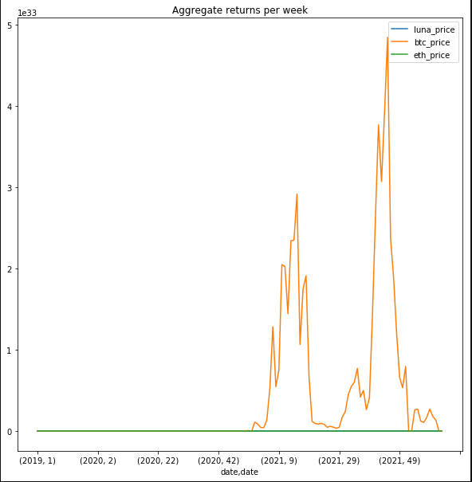

    * Crypto Daily Returns - The higher change in percentage of daily returns can be attributed to the fact that a small change in luna will have a much larger impact on the daily returns percentage then it would have on bitcoin. The graph can also help us determine which investment could be a more stable choice. 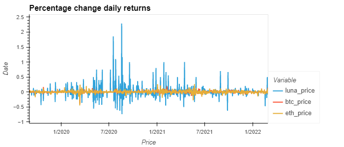

    * Crypto Correlation - Luna seems to have no correlation to either Btc or Eth. The correlation between Btc and Eth is positively correlated. 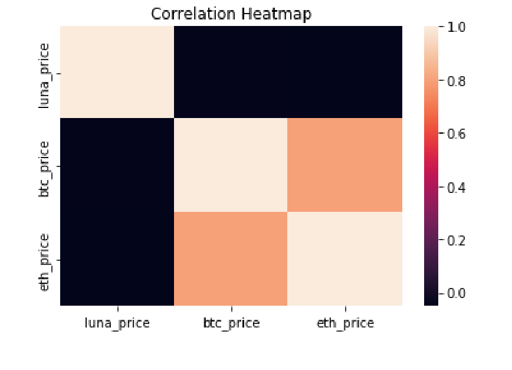

---

* ## Stable Coin Analysis and Plots
    * Price Comparisons - Using price comparison to determine stability of coins i.e. those that remain close to a value of 1.00  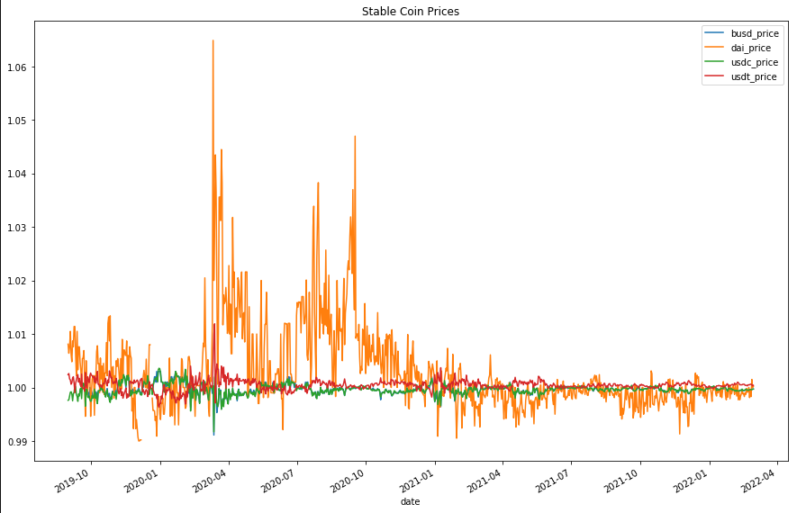

        * Candlestick Charts - Candlestick charts give a more accurate comparison due to the fact that the open, high, low, and close data is known. Provides for a robust representation of the price comparison data.  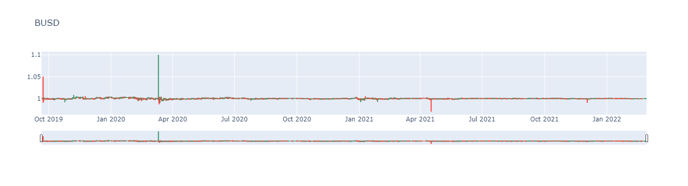

        * 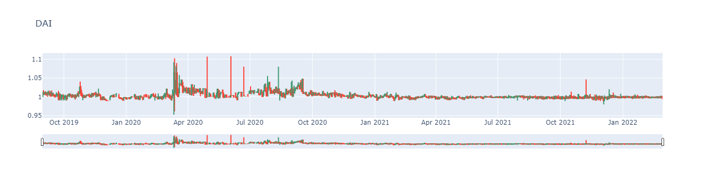

        * 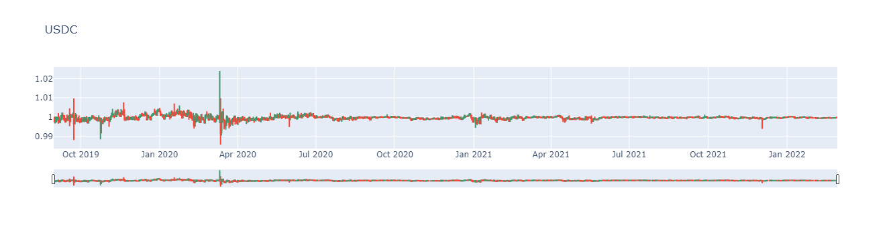

        * 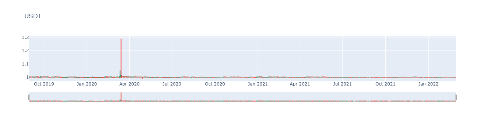

    * Aggregate Returns - The aggregate return function calculates the change in the value of the stable coin over a weekly basis and expresses it as a percentage of the original invested amount. We are primarily looking for stability within our coins. We can find outliers using the graph. For example the high fluctuations in Dai and USDT may not be the best option if you have a conservative outlook and on the other hand if you are a Forex trader you may see this as possible opportunities to make money.   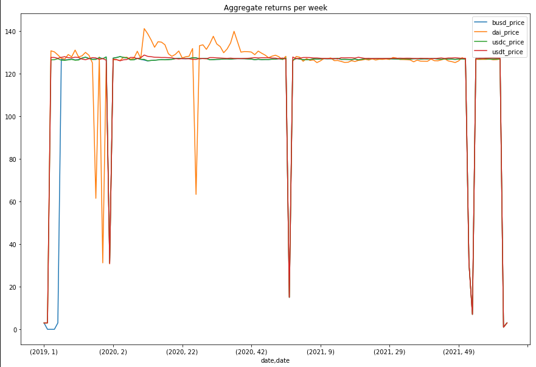

    * Stable coin percent change - The graph shows the percent change by day for the price of the stable coin. This is another excellent graph to determine stability. The closer the percentage change is to zero the coin will show more stability. You can see how the fluctuations in DAI can also show similar movement in DAI for the aggreagate returns graph. 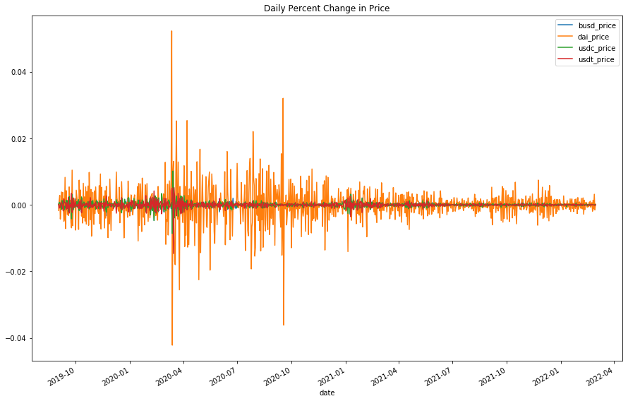

